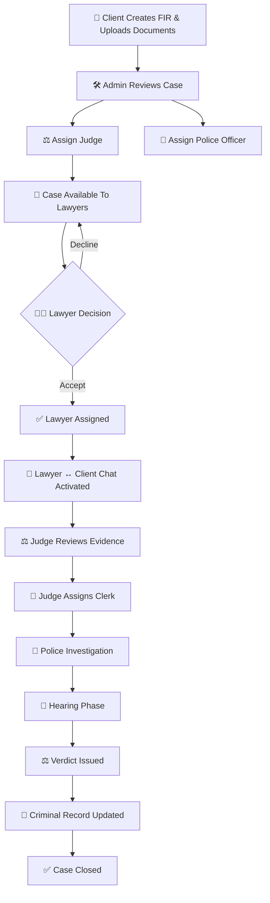
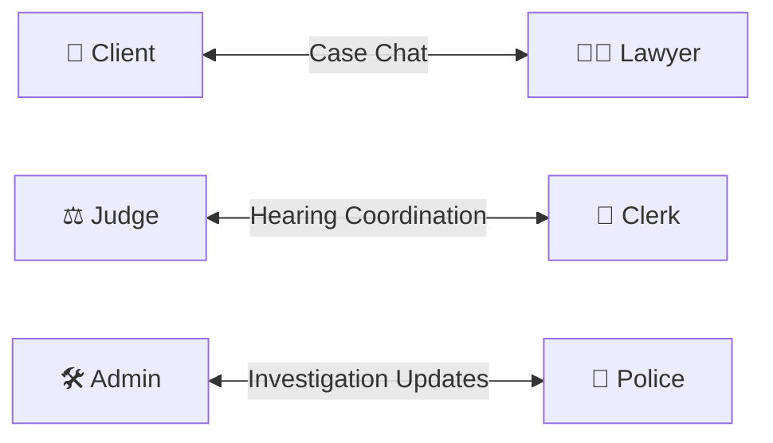
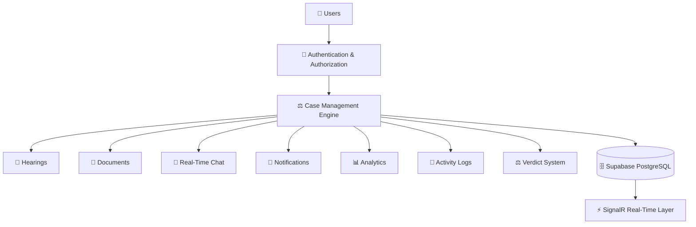
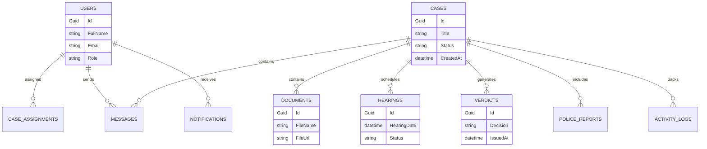

# ⚖️ LawFlow – Smart Judicial Case Management System

<div align="center">

## 🚀 Modern Judicial Workflow & Case Management Platform

**Built with**
`ASP.NET Core Blazor Server` • `C#` • `Entity Framework Core` • `SignalR` • `Supabase PostgreSQL`

---

### 🏛️ Digitizing Judicial Operations with Real-Time Collaboration

LawFlow centralizes judicial workflows into one secure, scalable, and modern SaaS-style platform for:

👨‍⚖️ Judges • 👨‍💼 Lawyers • 🧑 Clients • 👮 Police • 🧾 Clerks • 🛠️ Admins

---


</div>

---

# ✨ Overview

LawFlow is a **smart judicial ecosystem** that automates and streamlines court and legal operations through a centralized online portal.

The system focuses on:

* ⚖️ Judicial workflow automation
* 🔐 Role-based access control
* 💬 Real-time communication
* 📂 Case lifecycle management
* 📑 Document organization
* 📅 Hearing scheduling
* 📊 SaaS-style analytics dashboards

---

# 🧠 Core Architecture Philosophy

LawFlow follows a **Case-First Architecture**.

```text
User → Role → Case → Permissions → Actions
```

Every action inside the platform is scoped around a specific legal case, ensuring:

* secure access control
* workflow traceability
* accountability
* organized communication
* centralized records

---

# ⚡ Key Features

## ✅ Core Functionalities

| Feature                   | Description                                    |
| ------------------------- | ---------------------------------------------- |
| 🔐 Authentication System  | ASP.NET Identity with role-based authorization |
| ⚡ Real-Time Notifications | Live updates using SignalR                     |
| 📊 Analytics Dashboard    | Charts, statistics, timelines                  |
| 💬 Case-Based Chat        | Real-time communication per case               |
| 📂 Document Management    | Secure uploads & evidence handling             |
| 📅 Hearing Scheduling     | Calendar & hearing workflow                    |
| 📝 Activity Logging       | Full audit trails                              |
| 🔎 Search & Filtering     | Smart responsive data tables                   |
| 🎨 SaaS UI/UX             | Glassmorphism + responsive design              |
| 🌙 Theme Switching        | Persistent dark/light mode                     |

---

# 👥 User Roles & Responsibilities

## 🛠️ Admin

* Manage users & roles
* Approve submitted cases
* Assign judges & police officers
* Monitor analytics
* Oversee hearings & verdicts

---

## ⚖️ Judge

* Review assigned cases
* Evaluate evidence
* Assign clerks
* Conduct hearings
* Issue verdicts

---

## 👨‍💼 Lawyer

* Accept or decline cases
* Access case evidence
* Communicate with clients
* Monitor hearing schedules

---

## 🧑 Client

* Submit FIRs & legal cases
* Upload supporting documents
* Track case progress
* Chat with assigned lawyer

---

## 👮 Police Officer

* Conduct investigations
* Upload reports
* Maintain criminal records
* Collaborate with admin

---

## 🧾 Clerk

* Schedule hearings
* Manage court calendars
* Publish notifications
* Assist judges during proceedings

---

# 🔄 Judicial Workflow Lifecycle



---

# 💬 Case-Based Communication Model

LawFlow uses a **strict case-scoped communication system**.

Only authorized users linked to a case can communicate.



---

# 🏗️ High-Level System Architecture



---

# 🗂️ Database Architecture

## 📌 Main Entities



---

# ⚡ Real-Time Features (SignalR)

LawFlow uses **SignalR** for instant synchronization across the platform.

## Included Real-Time Systems

* 🔔 Live notifications
* 💬 Real-time chat
* ⚖️ Case status updates
* 📅 Hearing schedule updates
* 📊 Dashboard auto-refresh
* 📝 Activity stream updates

---

# 📊 Dashboard & Analytics

Every role gets a dedicated intelligent dashboard.

## Dashboard Components

* 📈 Statistics cards
* 📊 Bar & pie charts
* 🕒 Activity timelines
* 📂 Recent cases
* 🔔 Notification center
* ⚡ Quick actions

---

# 🎨 Modern SaaS UI/UX

LawFlow uses a premium modern interface inspired by contemporary SaaS platforms.

## UI Highlights

* ✨ Glassmorphism cards
* 🌙 Light/Dark theme
* 🎞️ Smooth animations
* 💡 Hover glow effects
* 📱 Fully responsive layouts
* 🧭 Sidebar navigation
* 🔥 Interactive tables & dashboards

---

# 🛠️ Technology Stack

## 🎨 Frontend

| Technology    | Purpose                 |
| ------------- | ----------------------- |
| Blazor Server | Frontend Framework      |
| MudBlazor     | UI Components           |
| Bootstrap 5   | Responsive Layout       |
| Tailwind CSS  | Utility Styling         |
| Chart.js      | Analytics Visualization |

---

## ⚙️ Backend

| Technology            | Purpose                 |
| --------------------- | ----------------------- |
| ASP.NET Core          | Backend Framework       |
| C#                    | Core Language           |
| Entity Framework Core | ORM                     |
| SignalR               | Real-Time Communication |

---

## 🗄️ Database

| Technology          | Purpose             |
| ------------------- | ------------------- |
| Supabase PostgreSQL | Primary Database    |
| Npgsql              | PostgreSQL Provider |

---

# 🔐 Security Features

LawFlow prioritizes secure judicial data management.

## Security Systems

* 🔐 ASP.NET Identity authentication
* 🛡️ Role-based authorization
* 🔒 Secure route protection
* 🔑 Password hashing
* 📂 File validation
* 📝 Audit logging
* 🧭 Session management

---

# 📱 Responsive Design

Optimized for:

* 💻 Desktop
* 📱 Mobile
* 📟 Tablets

---

# 🎯 Project Goals

LawFlow aims to:

* reduce manual paperwork
* modernize judicial operations
* centralize legal communication
* improve workflow transparency
* organize evidence & documents
* improve case tracking efficiency

---

# 🚀 Future Roadmap

## Planned Enhancements

* 🤖 AI-powered document analysis
* 🔍 OCR document scanning
* 📧 Email/SMS notifications
* 🎥 Video hearing system
* ✍️ E-signature integration
* 🌐 Multi-language support
* 🗓️ Court calendar integration
* 📍 Court location management

---

# 📌 Development Status

```diff
+ 🟢 ACTIVE DEVELOPMENT
+ Core Architecture Completed
+ UI/UX In Progress
+ Database Integration Active
+ SignalR Features In Development
```

---

# 👨‍💻 Developed By

## hasbeejay

> Built using modern .NET technologies to redefine judicial workflow management systems.

---

# ⭐ Support

If you like this project:

🌟 Star the repository
🍴 Fork the project
🛠️ Contribute to development

---

<div align="center">

# ⚖️ LawFlow

### Smart • Secure • Real-Time Judicial Management

</div>
